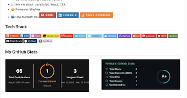

# My Test Learning Sheet
___
<!-- ## My Test Learning Sheet
### My Test Learning Sheet
#### My Test Learning Sheet
##### My Test Learning Sheet
###### My Test Learning Sheet -->
<p>i make this repo while i learn git in git course</p>

___

## Code 

inline  `code`

```json
{
    "firstName" : "sadaf",
    "userName" : "samimi",
    "userName" : "sadaf01371",
}

```
___

## Default Usage :
```javascript
let person = {
  code: function() {
    console.log("I'm coding");
  }
};
```

__

## Lists

Ordered:

1.JavaScript
2.Css
3.Html
4.Npm

Unordered :

- FronEnd(`HTML`,`Css`,`JavaScript` =>  Package)
    - vue.js
    - React.js
    - Node.js
    - Next.js

    ___

    ## Project Links

    [my Profile adress](https://github.com/Yasaman471)

    ___

    ## Images

    
